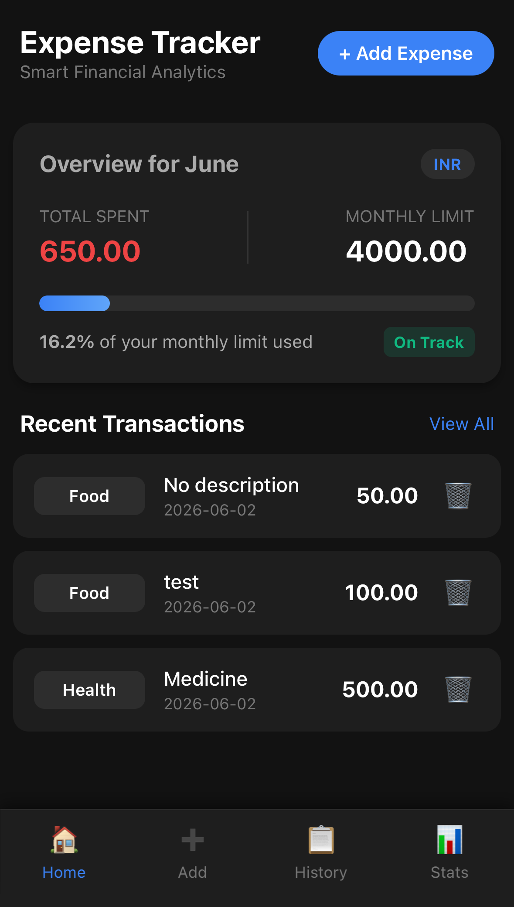
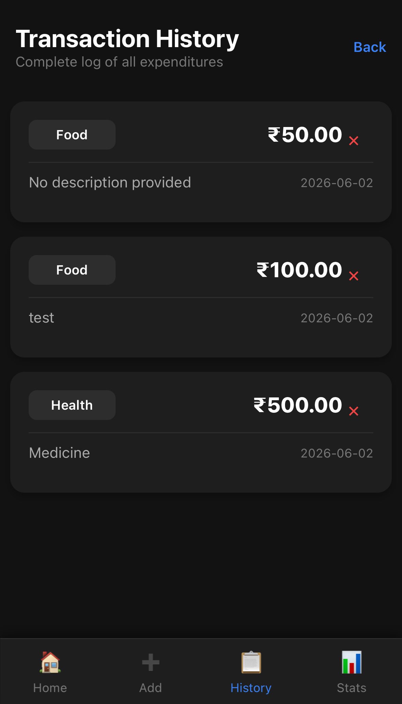
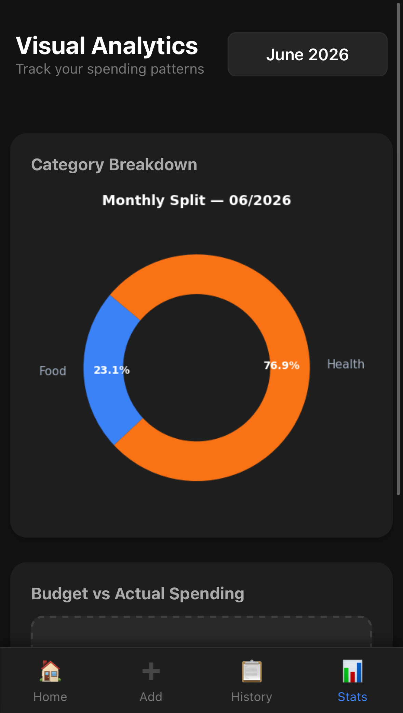

# 💰 Expense Tracker


## 🌐 Live Demo

**[http://129.80.250.183](http://129.80.250.183)**

> Deployed on Oracle Cloud Infrastructure — accessible 24/7

## 📱 Screenshots





## 📋 About

As a college student it's a constant struggle to keep track of my daily expenses. 
I wanted something personalized and catered to my requirements. This project 
started as a Python CLI tool and evolved into a full-stack web application 
deployed on Oracle Cloud Infrastructure, with real budget tracking, 
monthly reports, and spending charts. Built from scratch, deployed for real.

## ✨ Features

- Add and categorize daily expenses (Food, Transport, Shopping, Health, etc.)
- Real-time budget tracking with visual progress bars per category
- Monthly spending reports with category breakdowns
- Spending visualizations — pie charts, bar charts, and 6-month trend graphs
- Mobile-first responsive UI optimized for phone browsers
- Persistent storage — all data saved across sessions
- CSV export for any month's expenses

## 🛠️ Tech Stack

| Layer | Technology | Purpose |
|---|---|---|
| Language | Python 3.10 | Core application logic |
| Web Framework | Flask 3.1 | HTTP routing and templating |
| Database | SQLite | Persistent expense storage |
| Visualization | matplotlib | Chart generation |
| Web Server | Nginx | Reverse proxy, static files |
| App Server | Gunicorn | Production WSGI server |
| Cloud | Oracle Cloud Infrastructure | VM hosting (Always Free tier) |
| OS | Ubuntu 22.04 | Server operating system |
| Version Control | Git + GitHub | Source control and deployment |

## 🏗️ Architecture
- **Nginx** acts as a reverse proxy, handling incoming traffic and serving 
  static assets directly
- **Gunicorn** runs the Flask application as a production WSGI server
- **Systemd** keeps the application running continuously and restarts it 
  automatically on crashes or reboots

## 🚀 Running Locally

### Prerequisites
- Python 3.10+
- pip

### Steps

**1. Clone the repository**
```bash
git clone https://github.com/wadikarsaniya-prog/expense-tracker.git
cd expense-tracker
```

**2. Create and activate virtual environment**
```bash
python -m venv venv

# Windows
venv\Scripts\activate

# Mac/Linux
source venv/bin/activate
```

**3. Install dependencies**
```bash
pip install -r requirements.txt
```

**4. Run the app**
```bash
python app.py
```

**5. Open in browser**
```
http://localhost:5000
```
## ☁️ Deployment

Deployed on an Oracle Cloud Infrastructure Always Free VM with the 
following stack:

- **OS:** Ubuntu 22.04 on OCI VM.Standard.E2.1.Micro
- **App Server:** Gunicorn running as a systemd service
- **Web Server:** Nginx as reverse proxy on port 80
- **Firewall:** UFW + OCI Security Lists configured for ports 22, 80, 443

### Deploying Updates
```bash
# Local machine
git add .
git commit -m "your message"
git push

# On server
git pull
sudo systemctl restart expense-tracker
```
## 📚 What I Learned

This was my first complete software project, built over 3 weeks. 
Key concepts I developed hands-on:

- **Web development fundamentals** — HTTP request/response cycle, 
  Flask routing, Jinja2 templating
- **Database design** — SQLite schema design, SQL queries, 
  data persistence patterns
- **Cloud deployment** — provisioning a Linux VM on OCI, SSH, 
  configuring Nginx as a reverse proxy, systemd service management
- **Linux administration** — firewall configuration with UFW and 
  iptables, file permissions, process management
- **Software architecture** — separation of concerns, modular design, 
  production vs development environments
- **Data visualization** — generating and serving matplotlib charts 
  in a web application

## 👤 Author

**Wadi Karsaniya**  
[GitHub](https://github.com/wadikarsaniya-prog) · 
[LinkedIn](https://linkedin.com/in/YOUR_LINKEDIN_USERNAME)

---
*Built from scratch as a first software project — CLI to deployed web app.*
  
